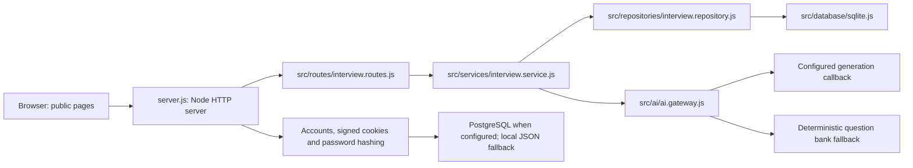
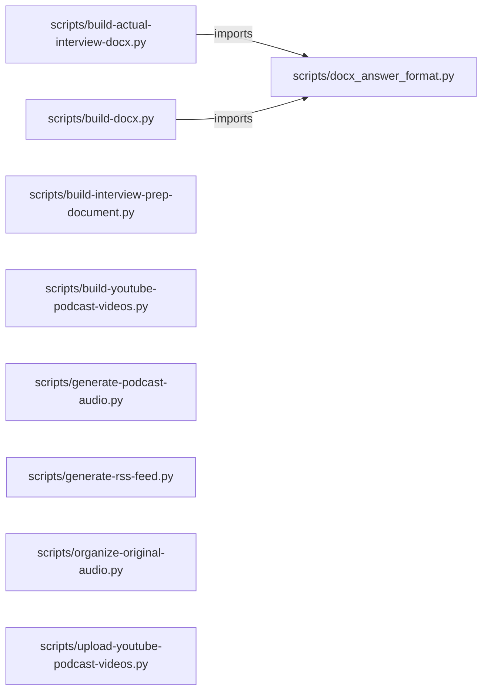

# ai-mock-interviewer — project architecture

[README](README.md) · [Interview questions and answers](INTERVIEW_QA.md)

## Purpose and scope

Voice-led AI mock interview practice for DevOps, SRE, Cloud, Platform Engineering, MLOps, and software engineering roles.

This document describes files and symbols in this checkout. Deployment templates and statements in the original overview are distinguished from a verified running environment.

## Application runtime architecture

The main application runs through [server.js](server.js), a Node HTTP server. The Python scripts later in this document are document/media export helpers, rather than the application backend.



The wiring is in `getInterviewRoutes` in [server.js](server.js). Interview-session storage uses the SQLite repository; account/authentication storage separately selects PostgreSQL or local JSON. These are distinct persistence paths.

### Interview request flow

1. [The route factory](src/routes/interview.routes.js) matches `/api/v1/interviews` and interview actions, reads the current user, and passes the request to the service.
2. [InterviewService](src/services/interview.service.js) owns the lifecycle and calls the repository and AI gateway.
3. [InterviewRepository](src/repositories/interview.repository.js) owns database access through [the SQLite factory](src/database/sqlite.js).
4. [AiGateway](src/ai/ai.gateway.js) accepts a generated question only when validation passes; provider failures or invalid results fall back to the deterministic bank.
5. The route layer returns a request ID and translates service errors to HTTP responses.

### Configuration and failure boundaries

[server.js](server.js) reads `PORT`, `HOST`, `DATABASE_URL`, `SESSION_SECRET`, `SQLITE_PATH`, `LLM_PROVIDER`, and `OFFLINE_ONLY`. Its production startup checks require an adequate session secret and configured account persistence unless the explicit file-storage override is enabled. Generated-question provider callbacks are configurable; the fallback path exists independently of provider availability.

Use `npm test` and the scripts in [package.json](package.json) for verification. The `verify` check is required by the repository rules before a default-branch update can merge.

## Python helper import diagram



For Python repositories, arrows show resolved local imports, not network calls or deployment order. Otherwise the diagram is a repository component map; containment arrows do not assert runtime integration.

## Components and responsibilities

| Component | Responsibility |
| --- | --- |
| [`scripts/build-interview-prep-document.py`](scripts/build-interview-prep-document.py) | Functions: `load_curriculum`, `set_cell_shading`, `set_cell_margins`, `set_table_geometry`, `set_repeat_header`, `style_run`, `write_cell` |
| [`scripts/build-docx.py`](scripts/build-docx.py) | Functions: `classify_question`, `build_example`, `add_heading`, `add_qa` |
| [`scripts/build-actual-interview-docx.py`](scripts/build-actual-interview-docx.py) | Functions: `set_font`, `shade_paragraph`, `set_cell_margins`, `add_page_field`, `configure_styles`, `parse_source` |
| [`scripts/generate-podcast-audio.py`](scripts/generate-podcast-audio.py) | Functions: `classify`, `clean_for_speech`, `sanitize_answer`, `est_seconds`, `build_script`, `_cycle_transitions`, `render` |
| [`package.json`](package.json) | Implementation or supporting configuration |
| [`server.js`](server.js) | Implementation or supporting configuration |
| [`api/[...path].js`](api/%5B...path%5D.js) | Implementation or supporting configuration |
| [`chrome-extension/content.js`](chrome-extension/content.js) | Implementation or supporting configuration |
| [`chrome-extension/popup.js`](chrome-extension/popup.js) | Implementation or supporting configuration |
| [`public/admin.js`](public/admin.js) | Implementation or supporting configuration |
| [`public/ai-agent-engineer-path.js`](public/ai-agent-engineer-path.js) | Implementation or supporting configuration |
| [`public/app.js`](public/app.js) | Implementation or supporting configuration |
| [`public/auth-client.js`](public/auth-client.js) | Authentication or access-control implementation |
| [`Dockerfile`](Dockerfile) | Container build/service configuration |
| [`tests/interview-prep.test.js`](tests/interview-prep.test.js) | Executable checks and regression examples |
| [`tests/interview.service.test.js`](tests/interview.service.test.js) | Executable checks and regression examples |
| [`tests/public-page.test.js`](tests/public-page.test.js) | Executable checks and regression examples |
| [`.github/workflows/ci.yml`](.github/workflows/ci.yml) | GitHub Actions job definitions |
| [`.github/pull_request_template.md`](.github/pull_request_template.md) | Project explanations or operating notes |
| [`30-day-interview-plan.md`](30-day-interview-plan.md) | Project explanations or operating notes |
| [`50-day-interview-plan.md`](50-day-interview-plan.md) | Project explanations or operating notes |

## Existing design and operating guides

These checked-in guides provide the project’s detailed design, operational context, or deployment view:

- [`SECURITY.md`](SECURITY.md).
- [`youtube-mock-interview-series/episode-001-gke-production-troubleshooting.md`](youtube-mock-interview-series/episode-001-gke-production-troubleshooting.md).
- [`youtube-mock-interview-series/episode-005-cloud-security-and-devsecops.md`](youtube-mock-interview-series/episode-005-cloud-security-and-devsecops.md).
- [`youtube-mock-interview-series/episode-01-gke-production-troubleshooting.md`](youtube-mock-interview-series/episode-01-gke-production-troubleshooting.md).
- [`youtube-mock-interview-series/episode-013-recently-asked-gcp-access-and-security-round.md`](youtube-mock-interview-series/episode-013-recently-asked-gcp-access-and-security-round.md).
- [`youtube-mock-interview-series/episode-017-gke-troubleshooting-and-reliability-round.md`](youtube-mock-interview-series/episode-017-gke-troubleshooting-and-reliability-round.md).
- [`youtube-mock-interview-series/episode-019-gcp-architecture-and-iam-round.md`](youtube-mock-interview-series/episode-019-gcp-architecture-and-iam-round.md).
- [`youtube-mock-interview-series/episode-035-architecture-review-risk.md`](youtube-mock-interview-series/episode-035-architecture-review-risk.md).
- [`youtube-mock-interview-series/episode-084-security-database-ansible-ci-cd-round-part-1.md`](youtube-mock-interview-series/episode-084-security-database-ansible-ci-cd-round-part-1.md).
- [`youtube-mock-interview-series/episode-085-security-database-ansible-ci-cd-round-part-2.md`](youtube-mock-interview-series/episode-085-security-database-ansible-ci-cd-round-part-2.md).
- [`youtube-mock-interview-series/episode-109-senior-gke-architecture-resource-security-and-cost-part-1.md`](youtube-mock-interview-series/episode-109-senior-gke-architecture-resource-security-and-cost-part-1.md).
- [`youtube-mock-interview-series/episode-110-senior-gke-architecture-resource-security-and-cost-part-2.md`](youtube-mock-interview-series/episode-110-senior-gke-architecture-resource-security-and-cost-part-2.md).

## Implementation walkthrough

### `build(track='complete')`

Source: [`scripts/build-interview-prep-document.py`](scripts/build-interview-prep-document.py#L275).

Calls visible in this function: `Document`, `Inches`, `Pt`, `add_ai_engineer_callout`, `add_domain_index`, `add_domains`, `add_footer`, `add_role_matrix`, `add_stage_index`, `add_topic_stage_index`, `configure_styles`, `date.today`.

```python
def build(track="complete"):
    data = load_curriculum()
    is_data_science = track == "data-science"
    is_ai_agent = track == "ai-agent"
    if is_data_science:
        domains = select_data_science_domains(data)
    elif is_ai_agent:
        domains = [{"name": stage["name"], "description": stage["description"], "topics": stage["topics"]} for stage in data["aiAgentEngineerPath"]["stages"]]
    else:
        domains = data["domains"]
    unique_topics = {topic.lower() for domain in domains for topic in domain["topics"]}
    out_path = AI_AGENT_OUT_PATH if is_ai_agent else (DATA_SCIENCE_OUT_PATH if is_data_science else OUT_PATH)
    title_text = "AI Agent Engineer Interview Prep" if is_ai_agent else ("Data Science Interview Prep" if is_data_science else "AI Engineer Interview Prep")
    subtitle_text = (
        "Job-aligned path for Python, LLM APIs, MCP, RAG, enterprise automation, agent safety, and AWS operations"
        if is_ai_agent else
        "Beginner-to-expert path for statistics, experimentation, machine learning, applied GenAI, and production literacy"
        if is_data_science else
        "Beginner-to-expert curriculum for Data Science, ML Engineering, and production AI"
    )
    doc = Document()
    section = doc.sections[0]
```

The excerpt is truncated; the linked source contains the full implementation.

### `add_qa(number, entry)`

Source: [`scripts/build-docx.py`](scripts/build-docx.py#L175).

Calls visible in this function: `' • '.join`, `Inches`, `Pt`, `RGBColor`, `a_para.add_run`, `append_answer_runs`, `build_example`, `cat_para.add_run`, `code_run.add_break`, `date_para.add_run`, `doc.add_paragraph`, `entry.get`.

```python
def add_qa(number, entry):
    q_para = doc.add_paragraph()
    q_para.paragraph_format.space_before = Pt(10)
    q_para.paragraph_format.space_after = Pt(2)
    question_text = entry["question"]
    if "\n" in question_text:
        lines = question_text.split("\n")
        q_run = q_para.add_run(f"Q{number}. {lines[0]}")
        q_run.bold = True
        q_run.font.size = Pt(11.5)
        for line in lines[1:]:
            code_run = q_para.add_run()
            code_run.add_break()
            code_run.text = line if line.strip() else " "
            code_run.font.name = "Consolas"
            code_run.font.size = Pt(9.5)
            code_run.font.color.rgb = RGBColor(0x33, 0x33, 0x33)
    else:
        q_run = q_para.add_run(f"Q{number}. {question_text}")
        q_run.bold = True
        q_run.font.size = Pt(11.5)
    metadata = " • ".join(filter(None, [entry.get("category"), entry.get("questionType")]))
```

The excerpt is truncated; the linked source contains the full implementation.

### `build_example(entry)`

Source: [`scripts/build-docx.py`](scripts/build-docx.py#L73).

Calls visible in this function: `' '.join`, `' '.join([entry.get('section') or '', entry.get('category') or '', entry.get('question') or '']).lower`, `classify_question`, `entry.get`, `re.search`.

```python
def build_example(entry):
    text = " ".join([
        entry.get("section") or "",
        entry.get("category") or "",
        entry.get("question") or "",
    ]).lower()
    examples = [
        (r"\b(shared vpc|vpc peering|cloud router|bgp|ha vpn|interconnect|cloud nat|private service connect|psc)\b",
         "For example, place application projects in a Shared VPC, advertise only approved CIDRs through Cloud Router and BGP, and verify the path with Connectivity Tests and VPC Flow Logs before changing production routes."),
        (r"\b(load balanc|health check|cloud armor)\b",
         "For example, expose a GKE service through a global HTTPS load balancer, use a `/healthz` backend health check, and apply a Cloud Armor rate-limit rule before allowing public traffic."),
        (r"\b(kubernetes|gke|pod|deployment|statefulset|daemonset|readiness|liveness|hpa|node pool)\b",
         "For example, deploy version v2 with a readiness probe and `maxUnavailable: 0`; Kubernetes adds a healthy v2 pod before terminating a v1 pod, preserving capacity during the rollout."),
        (r"\b(terraform|infrastructure as code|remote state|state lock|drift)\b",
         "For example, store Terraform state in a versioned GCS backend, run `terraform plan` in the pull request pipeline, require approval, and apply only the reviewed plan from the protected main branch."),
        (r"\b(jenkins|ci/cd|pipeline|gitops|argo cd|github actions|gitlab ci|canary|blue-green)\b",
         "For example, a Jenkins pipeline can run tests and security scans, publish an immutable image to Artifact Registry, update the GitOps repository, and let Argo CD reconcile the approved deployment. If health checks fail, explicitly revert to the known-good Git revision or use separately configured progressive-delivery rollback automation."),
        (r"\b(prometheus|grafana|opentelemetry|observability|monitoring|logging|sli|slo|error budget)\b",
         "For example, define availability as successful requests divided by total requests, set a 99.9% SLO, page on fast error-budget burn, and use traces plus correlated logs to identify the failing dependency."),
        (r"\b(iam|workload identity|secret|zero trust|waf|owasp|sast|dast|devsecops|security)\b",
         "For example, map a Kubernetes service account to a least-privilege Google service account with Workload Identity, keep credentials in Secret Manager, and block high-risk requests with Cloud Armor."),
        (r"\b(mlops|vertex ai|mlflow|kubeflow|model serving|model monitoring|data drift|llm|rag)\b",
```

The excerpt is truncated; the linked source contains the full implementation.

### `configure_styles(doc)`

Source: [`scripts/build-actual-interview-docx.py`](scripts/build-actual-interview-docx.py#L76).

Calls visible in this function: `Inches`, `Pt`, `doc.styles.add_style`, `tokens.items`.

```python
def configure_styles(doc):
    normal = doc.styles["Normal"]
    normal.font.name = "Calibri"
    normal.font.size = Pt(11)
    normal.paragraph_format.space_before = Pt(0)
    normal.paragraph_format.space_after = Pt(6)
    normal.paragraph_format.line_spacing = 1.25

    tokens = {
        "Heading 1": (16, BLUE, 18, 10),
        "Heading 2": (13, BLUE, 14, 7),
        "Heading 3": (12, DARK_BLUE, 10, 5),
    }
    for name, (size, color, before, after) in tokens.items():
        style = doc.styles[name]
        style.font.name = "Calibri"
        style.font.size = Pt(size)
        style.font.bold = True
        style.font.color.rgb = color
        style.paragraph_format.space_before = Pt(before)
        style.paragraph_format.space_after = Pt(after)
        style.paragraph_format.keep_with_next = True
```

The excerpt is truncated; the linked source contains the full implementation.

## Validation and failure paths

| Explicit exception | Source |
| --- | --- |
| `SystemExit('Missing youtube-client-secret.json. Download an OAuth Desktop client from Google Cloud Console and place it in the repository root.')` | [`scripts/upload-youtube-podcast-videos.py`](scripts/upload-youtube-podcast-videos.py#L34) |
| `SystemExit(f"Scheduled time must be in the future: {item['publish_at']}")` | [`scripts/upload-youtube-podcast-videos.py`](scripts/upload-youtube-podcast-videos.py#L75) |

These are explicit exceptions in the inspected source, rather than a claim that every failure is handled. Follow the calling handler to see whether the exception becomes an HTTP response or propagates.

## Data and state

- [`scripts/build-docx.py`](scripts/build-docx.py) defines module-level containers: `TOPIC_SECTIONS`.
- [`scripts/generate-podcast-audio.py`](scripts/generate-podcast-audio.py) defines module-level containers: `TRANSITIONS`, `EXCLUDE_EXACT`, `EXCLUDE_SUBSTR`, `RULES`, `SERIES_TITLES`.
- [`scripts/generate-rss-feed.py`](scripts/generate-rss-feed.py) defines module-level containers: `SERIES_ORDER`.
- [`scripts/organize-original-audio.py`](scripts/organize-original-audio.py) defines module-level containers: `EXCLUDE_EXACT`, `EXCLUDE_SUBSTR`, `RULES`.
- [`scripts/upload-youtube-podcast-videos.py`](scripts/upload-youtube-podcast-videos.py) defines module-level containers: `SCOPES`.

Module-level dictionaries/lists live in a Python process. They can be fixtures or mutable state; inspect writes before treating them as persistent storage. A production extension would need to define persistence and concurrency behavior explicitly.

## JavaScript/TypeScript execution contracts

| Manifest | Script | Command defined by the project |
| --- | --- | --- |
| [`package.json`](package.json) | `start` | `node server.js` |
| [`package.json`](package.json) | `start:offline` | `node scripts/start-offline.js` |
| [`package.json`](package.json) | `start:production` | `node server.js` |
| [`package.json`](package.json) | `sync:question-bank` | `node scripts/generate-full-qa-document.js && node scripts/generate-txt-exports.js && node scripts/run-python.js scripts/build-docx.py` |
| [`package.json`](package.json) | `sync:actual-interviews` | `node scripts/sync-actual-interview-mock-set.js && node scripts/generate-full-qa-document.js && node scripts/audit-answer-quality.js && node scripts/generate-txt-exports.js && node scripts/run-python.js scripts/build-docx.py && node scripts/build-actual-interview-qa.js && node scripts/run-python.js scripts/build-actual-interview-docx.py` |
| [`package.json`](package.json) | `sync:interview-prep` | `node scripts/run-python.js scripts/build-interview-prep-document.py` |
| [`package.json`](package.json) | `audit:answer-quality` | `node scripts/audit-answer-quality.js` |
| [`package.json`](package.json) | `check:production` | `node scripts/check-production-readiness.js` |
| [`package.json`](package.json) | `check:release` | `npm test && npm run audit:answer-quality && npm run check:repository` |
| [`package.json`](package.json) | `test` | `node --test tests/*.test.js` |
| [`package.json`](package.json) | `stop` | `lsof -ti:${PORT:-3030} &#124; xargs kill 2>/dev/null &#124;&#124; echo 'No process running on port '${PORT:-3030}` |
| [`package.json`](package.json) | `test:documents` | `node scripts/run-python.js tests/test_docx_answer_format.py` |

Run a script from the directory containing its manifest. Script names are package contracts; their presence does not show that their dependencies are installed or that they pass.

## Data flow and design decisions

### What is the input-to-output contract of `build`

In [`scripts/build-interview-prep-document.py`](scripts/build-interview-prep-document.py#L275), `build(track='complete')` receives the inputs. The function computes these intermediate values:

- `data = load_curriculum()`
- `is_data_science = track == 'data-science'`
- `is_ai_agent = track == 'ai-agent'`
- `unique_topics = {topic.lower() for domain in domains for topic in domain['topics']}`
- `out_path = AI_AGENT_OUT_PATH if is_ai_agent else DATA_SCIENCE_OUT_PATH if is_data_science else OUT_PATH`
- `title_text = 'AI Agent Engineer Interview Prep' if is_ai_agent else 'Data Science Interview Prep' if is_data_science else 'AI Engineer Interview Prep'`
- `subtitle_text = 'Job-aligned path for Python, LLM APIs, MCP, RAG, enterprise automation, agent safety, and AWS operations' if is_ai_agent else 'Beginner-to-expert path for statistics, experimentation, machine learning, applied GenAI, and production literacy' if is_data_science else 'Beginner-to-expert curriculum for Data Science, ML Engineering, and production AI'`

### Which decision rules or boundary conditions should an interviewer challenge

The implementation in [`scripts/build-interview-prep-document.py`](scripts/build-interview-prep-document.py#L275) branches on:

- `is_data_science`
- `is_ai_agent`
- `is_ai_agent`
- `is_data_science`

A useful extension is a table-driven test that covers each condition just below, at, and above its boundary where applicable. These expressions are the current rules; changing them changes behavior and should be justified by the project’s acceptance criteria.

### What does `server.js` own

[`server.js`](server.js) defines `ensureDataDir`, `getSessionSecret`, `hashPassword`, `verifyPassword`, `readUsers`, `writeUsers`, `ensureUsersSeeded`, `initializeDatabase`. Its imports include `dotenv`, `http`, `fs`, `path`, `crypto`, `mammoth`, `pdf-parse`, `tesseract.js`, `@anthropic-ai/sdk`, `pg`.

Trace these definitions and imports to explain the module boundary. Relative imports identify project code; package imports should be checked against the nearest manifest.

### What does `src/routes/interview.routes.js` own

[`src/routes/interview.routes.js`](src/routes/interview.routes.js) defines `createInterviewRoutes`, `errorResponse`, `handleInterviewRoutes`.

Trace these definitions and imports to explain the module boundary. Relative imports identify project code; package imports should be checked against the nearest manifest.

## Setup and verification

The following commands are derived from the checked-in dependency/test contracts. Execute them from the repository root; the block prepares a local environment, not a cloud deployment.

```bash
npm install
npm test
npm run start
```

Test entry points: [`tests/interview-prep.test.js`](tests/interview-prep.test.js), [`tests/interview.service.test.js`](tests/interview.service.test.js), [`tests/public-page.test.js`](tests/public-page.test.js), [`tests/repository-check.test.js`](tests/repository-check.test.js), [`tests/test_docx_answer_format.py`](tests/test_docx_answer_format.py).

Automation definitions: [`.github/workflows/ci.yml`](.github/workflows/ci.yml). Read their triggers and job steps to determine what CI actually runs.

## Operating boundaries and design review

Before turning this checkout into a customer deployment, establish the input contract, data ownership, access controls, failure response, evaluation criteria, and rollback owner. Repository fixtures and unit tests demonstrate local behavior; they do not establish throughput, uptime, compliance, or business impact.

A useful architecture review starts with the linked implementation: identify where input enters, where a decision is made, which state can change, and which external dependency can fail. Add a deployment view only for infrastructure that is actually configured and exercised.
